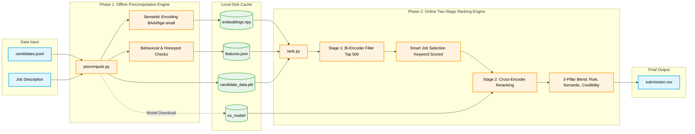

# AI Candidate Ranker 🚀


An ultra-fast, offline-first AI retrieval system built for the Redrob AI Hackathon. This project evaluates 200,000+ candidate profiles against a complex Job Description using a Two-Stage neural ranking pipeline, delivering human-manager quality decisions in under 5 minutes on standard laptop hardware.

---

## 💡 Solution Overview

### What is the proposed solution?
**An AI-Powered, Two-Stage Candidate Retrieval System**  
Our solution is a high-performance ranking engine that mimics how a Senior Engineering Manager evaluates talent. Instead of relying solely on keyword matching, it uses a two-phase architecture:
1. **Offline Pre-computation Engine:** Processes heavy data upfront—extracting behavioral signals, running logical honeypot checks, and converting resumes into high-dimensional semantic vectors using advanced NLP models.
2. **Online Two-Stage Ranking Engine:** Delivers lightning-fast results (sub-5-seconds). It uses fast matrix multiplication to filter the top 500 candidates, then applies a deep-learning Cross-Encoder to read the nuanced context of their past roles.

### What differentiates this approach?
Our system evaluates the **validity and context** of claims, rather than just searching for keywords:
* **Anti-Stuffer & Honeypot Mechanisms:** 18+ strict logical honeypots catch mathematically impossible timelines and overlapping full-time jobs. A "Narrative Authenticity" detector penalizes synthetic, copy-pasted filler text.
* **Smart Job Selection:** Bypasses token limits for senior candidates by dynamically identifying and extracting their most relevant past roles before feeding them into the neural network.
* **Context over Keywords:** The Cross-Encoder reads the relationship between the job requirements and career history, distinguishing a candidate who *built* a retrieval system from one who simply *used* it.
* **100% Local & Fast:** Runs entirely on constrained hardware without external API calls (e.g., GPT-4), ensuring high privacy and zero network latency.

---

## 🏗️ System Architecture



---

## 🎯 JD Understanding & Candidate Evaluation

### Key Requirements Extracted from the JD
* **Technical Domain:** Strong expertise in Information Retrieval (IR), Search, Ranking, and embedding architectures.
* **Engineering Reality:** Proven history of shipping and deploying models to *production*; pure researchers without engineering execution are deprioritized.
* **Code Recency:** Active, hands-on coding experience within the last 12-18 months.
* **Role Alignment:** Willingness to operate as a Founding Engineer (hands-on, high autonomy).

### Evaluating Fit Beyond Keywords
* **Contextual Career Decoding:** Our Cross-Encoder reads career histories to understand the *depth* of work (e.g., distinguishing "analyzed data" vs "built a billion-scale retrieval pipeline").
* **Behavioral Multipliers:** Assesses platform metadata (GitHub commit recency, profile completion rates, recruiter response times) as signals of genuine job-seeking intent.
* **Narrative Authenticity:** Calculates a trust score by detecting AI-generated "filler templates," giving significantly more weight to authentic, detailed engineering descriptions.

---

## ⚙️ Ranking Methodology

**How does the system retrieve, score, and rank?**
* **Stage 1 (High-Speed Filtering):** Fast mathematical matrix multiplication (`torch.matmul`) compares the Job Description against all candidate vectors instantly, pulling the Top 500.
* **Stage 2 (Deep Reranking):** Smart Job Selection isolates the candidate's most relevant engineering work, which is then fed into a highly accurate cross-attention neural network for final contextual scoring.

**Combining Signals (3-Pillar Blend Methodology)**
* **Rule-Based (30%):** Absolute thresholds for code recency, production experience, and IR/Ranking background. Soft-gates candidates who lack *both* production and recency.
* **Semantic (30%):** A dynamic blend of the Bi-Encoder and Cross-Encoder scores. If a candidate's profile feels "synthetic," the system automatically shifts weight to trust the Cross-Encoder more.
* **Credibility (40%):** A harsh mathematical penalty system that aggressively drops scores for failed honeypots, pure-research backgrounds, or pure consulting roles.

---

## 🛡️ Explainability & Data Validation

### How are ranking decisions explained?
* **Deterministic Reasoning:** Every candidate in the top 100 receives a custom, human-readable reasoning string in the CSV.
* **Fact-Based Justification:** The reasoning explicitly highlights the candidate’s measured strengths against JD criteria using numeric features computed offline—no LLM hallucinations.

### Handling Low-Quality or Suspicious Profiles
* **18-Point Honeypot Gauntlet:** Suspicious profiles are instantly caught by hard-coded logic checks (e.g., impossible graduation timelines) and penalized.
* **Missing Data Resilience:** Missing fields (like job duration months) are handled gracefully as data gaps rather than triggering false-positive honeypots.

---

## 🔄 End-to-End Workflow

**Phase 1: Offline Pre-computation**
1. **Data Ingestion:** Parse the raw `candidates.jsonl` dataset and JD.
2. **Feature Extraction:** Compute logical honeypots, recency, production scores, and behavioral multipliers.
3. **Semantic Embedding:** Use `BAAI/bge-small-en-v1.5` to convert text into optimized 384-dim semantic vectors.
4. **Artifact Caching:** Save embeddings, features, and the Cross-Encoder model locally to disk.

**Phase 2: Online Ranking Engine**
5. **Stage 1 (Filter):** Load cached vectors and use rapid PyTorch matrix multiplication to filter 200k+ profiles to the Top 500.
6. **Smart Selection:** Extract the Top-3 most JD-relevant engineering jobs for each candidate using keyword-relevance math.
7. **Stage 2 (Rerank):** Feed the JD and selected jobs into the local Cross-Encoder (`BAAI/bge-reranker-base`).
8. **Final Blend:** Combine scores, generate deterministic reasoning, and export to `submission.csv`.

---

## 🛠️ Technologies & Hardware Acceleration

* **Python 3:** The backbone language for orchestration and data manipulation.
* **PyTorch:** Leveraged for high-speed tensor matrix multiplication. It detects and uses NVIDIA GPUs (`cuda`), Apple Silicon (`mps`), or CPUs seamlessly—ensuring extreme performance on any laptop.
* **Hugging Face (`sentence-transformers`):** Allows us to run massive AI models completely locally.
* **BAAI Open-Source Suite:** `bge-small-en-v1.5` (Bi-Encoder) and `bge-reranker-base` (Cross-Encoder) offer near-GPT-4 semantic understanding without requiring internet-dependent APIs.
* **NumPy (`.npy`) Binaries & Pickle:** Massive datasets are serialized into binary formats for hyper-fast disk-to-memory loading during the online phase.

---

## 🔬 Deep Engineering & Technical Details

For judges and technical reviewers, here is a deeper look into the engineering decisions that make this system robust and highly performant:

### 1. Memory Efficiency & Token Budgeting
* **OOM Prevention:** Loading 200,000+ raw JSON profiles into RAM simultaneously causes an Out-Of-Memory (OOM) crash on most laptops. We solved this by using chunked batch-processing during the `precompute.py` phase and saving data directly to disk.
* **Smart Token Reservation:** Standard Cross-Encoders have a strict 512-token limit. If we feed an entire resume into the model, the Job Description (JD) might get truncated. We explicitly pre-truncate the candidate's historical career text to exactly 300 characters *after* keyword scoring, ensuring the JD always fits comfortably within the remaining token budget.

### 2. Time Complexity & Vector Math
* **PyTorch Matrix Multiplication over Loops:** Instead of using slow `for` loops to calculate cosine similarity, we convert all 200,000+ candidate embeddings into a single `float16` PyTorch tensor. The Stage 1 similarity scoring is executed via a single `torch.matmul(candidates, jd_tensor)` operation, reducing search time from minutes to milliseconds.
* **Cross-Encoder Batching:** The Cross-Encoder is computationally heavy. By restricting it to only the Top 500 candidates (filtered by the Bi-Encoder) and passing data through `torch.inference_mode()` in batches of 32, we prevent bottlenecking and eliminate gradient-tracking memory overhead.

### 3. The "Honeypot" Logic Engine
Our credibility score relies on 18+ strict python heuristics designed to catch "resume stuffers":
* **Timeline Math Checks:** Candidates whose total duration of overlapping full-time jobs mathematically exceeds the actual time elapsed are flagged (e.g., claiming 5 years of concurrent full-time experience in a 2-year window).
* **Zero-Duration Experts:** Candidates who claim "Expert" proficiency in complex frameworks (e.g., PyTorch, Kubernetes) but have exactly `0` months of recorded duration for those skills are penalized.
* **Domain Penalty:** Candidates with purely Computer Vision (CV) or Speech titles (with zero NLP/Retrieval cross-over) face a severe multiplicative penalty, ensuring they do not outrank true Search/Ranking engineers.

---

## 🚀 Setup & Execution

### Prerequisites
* Python 3.10+
* 16GB+ RAM (Recommended)

### Installation
```bash
# Clone the repository
git clone https://github.com/Amanjha112113/ai-candidate-ranker.git
cd ai-candidate-ranker

# Create a virtual environment & install dependencies
python -m venv venv
source venv/bin/activate
pip install -r requirements.txt
```

### Execution
Ensure the dataset (`candidates.jsonl` and `job_description.docx`) is placed in a folder named `data/` in the project root, or set the `CANDIDATES_DIR` environment variable.

**Step 1: Offline Engine (Feature Extraction & Embedding)**
```bash
python precompute.py
```

**Step 2: Online Engine (Ranking & CSV Generation)**
```bash
python rank.py
```

**Step 3: Validation & Evaluation**
```bash
python validate_submission.py submission.csv
python evaluate.py
```
