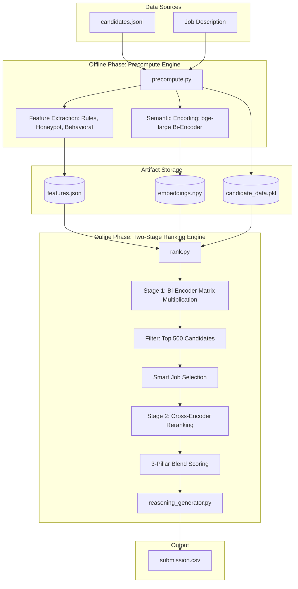

# Candidate Ranking System Architecture

This document details the software architecture, data flow, and core computational components of the AI-powered candidate ranking system.

## 1. High-Level Architecture Diagram

The system operates in a two-phase architecture: an **Offline Precomputation Engine** and an **Online Two-Stage Ranking Engine**.

## 2. Phase 1: Offline Precomputation Engine (`precompute.py`)

Because processing 200k+ candidates in real-time is too slow, the system pushes all heavy NLP and feature extraction into an offline phase.

### Responsibilities:
1. **Data Ingestion**: Parses raw `candidates.jsonl` (or `.gz`) files.
2. **Global Analytics**: Computes global frequencies of skills across the entire candidate pool to identify rare vs. common skills.
3. **Semantic Encoding**:
   - Uses `SentenceTransformer` (`BAAI/bge-large-en-v1.5`) to convert the Job Description, Candidate Career History, and Candidate Skills into high-dimensional (1024-dim) dense vectors.
   - Saves these vectors to disk as optimized `.npy` binaries.
4. **Behavioral & Honeypot Analysis**:
   - `honeypot_checks.py`: Evaluates logic rules (e.g., overlapping full-time careers, impossible timeline math) to detect fake or inflated profiles.
   - `behavioral_signals.py`: Evaluates platform signals (profile completion, recruiter response times, github activity) to generate a behavioral trust multiplier.
5. **Authenticity Detection**: Dynamically scans career descriptions to identify synthetic "filler templates" reused across multiple profiles, penalizing candidates with low authenticity.
6. **Artifact Generation**: Serializes all structured features to `features.json` and raw data to `candidate_data.pkl`.

## 3. Phase 2: Online Ranking Engine (`rank.py`)

The online phase is designed for ultra-low latency execution (sub 5 seconds) to yield final candidate rankings using a Two-Stage retrieval pipeline.

### Responsibilities:
1. **Artifact Loading**: Rapidly loads `.npy`, `.json`, and `.pkl` artifacts into memory.
2. **Stage 1: Bi-Encoder Filtering**:
   - Converts `career_embeddings` and `skills_embeddings` to PyTorch Tensors.
   - Computes cosine similarity via highly optimized matrix multiplication (`torch.matmul`) against the JD vector.
   - Multiplies the base semantic score by the pre-computed `authenticity` score.
   - Applies the 3-Pillar blend to extract the **Top 500** candidates for the next stage.
3. **Stage 2: Cross-Encoder Reranking**:
   - **Smart Job Selection**: For each of the Top 500 candidates, the Bi-Encoder dynamically scores their individual job descriptions against the JD to select the **Top-3 most relevant roles**. This avoids truncating important historical context for senior candidates.
   - The selected jobs are paired with the JD and fed into a Cross-Encoder (`BAAI/bge-reranker-base`) via `torch.inference_mode()`.
   - The resulting logits are Min-Max normalized to `[0, 1]` and blended 50/50 with the Stage 1 semantic score.
4. **3-Pillar Blend Mechanism**:
   - **Pillar 1 - Rule-Based (30%)**: Scores candidates on absolute criteria like production experience, recency of coding, and specific ranking/retrieval domain expertise.
   - **Pillar 2 - Semantic (30%)**: The newly blended Stage 1 (Bi-Encoder) and Stage 2 (Cross-Encoder) score.
   - **Pillar 3 - Credibility (40%)**: Applies harsh multiplicative penalties for failed honeypots, pure-consulting experience, title chasing, and research-only backgrounds.
5. **Final Output Generation**: Sorts the final Top 100 candidates, passes them through `reasoning_generator.py` for human-readable summaries, and exports to `submission.csv`.

## 4. Evaluation & Accuracy (`evaluate.py`)

Since the problem statement lacks ground-truth human labels, the architecture includes an offline evaluation script. 
It uses robust heuristic pseudo-labels (combining production experience, recency, and zero honeypots) to compute metrics such as:
- **Precision@K** & **NDCG@K**
- **Score Distribution and Separation**
- **Honeypot Leak Rates**

## 5. Storage & State Management

The architecture heavily relies on file-based artifact caching to pass state between the offline and online engines.

- **`embeddings.npy`**: NumPy arrays holding FP16 compressed 1024-dim vector embeddings. Extremely fast to load into memory.
- **`features.json`**: Key-value map of `candidate_id` to pre-calculated numerical features (e.g., honeypot flags, production score, behavioral multiplier).
- **`candidate_data.pkl`**: Pickled Python objects retaining the full raw JSON of each candidate, required for generating the final reasoning text.

## 6. Extensibility & Performance

- **Memory Efficiency**: By vectorizing the skill corroboration and running the heavy Cross-Encoder only on the Top 500 candidates, the memory footprint and latency remain tightly constrained.
- **Hardware Acceleration**: The `rank.py` script gracefully handles both CPU and GPU execution, harnessing PyTorch tensor multiplication natively.
- **Configurability**: `config.py` acts as the single source of truth for all paths, hyper-parameters, and model choices.
