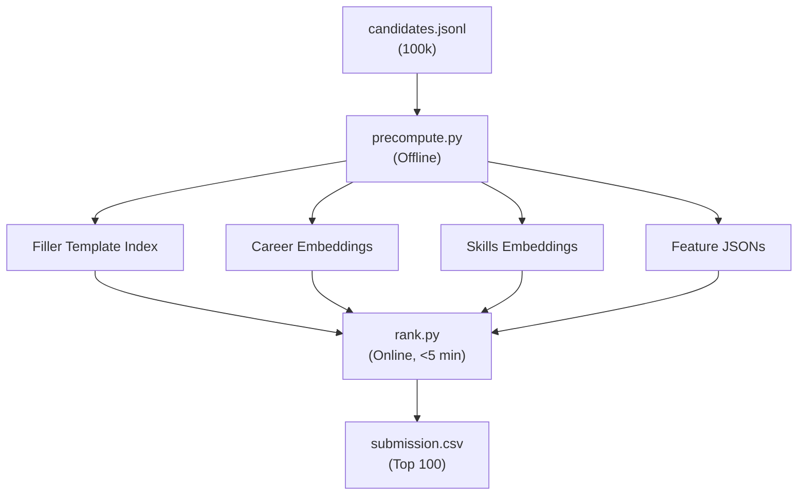

# Full Architecture Report

## Overview
The system is a **3-Pillar Candidate Ranking Engine** designed for the India Runs by Redrob AI Hackathon. It ranks 100k synthetic candidates against a Senior AI Engineer JD, with strict fraud detection and anti-gaming measures.

---

## Pipeline Summary



---

## Phase 1: Pre-Computation (`precompute.py`)

### 1. Filler Template Detection (NEW — Highest Impact)
The dataset is **synthetically generated** with a small bank of ~100-200 stock career description paragraphs. These are randomly attached to candidates regardless of their stated title (e.g., a "Marketing Manager" gets a description about mechanical engineering design).

**How it works:**
- Scan all 100k candidates' `career_history[].description` fields.
- Normalize each description (lowercase, first 100 chars).
- Count how many **distinct** candidates each template appears in.
- Any template appearing in ≥20 distinct candidates → **filler template**.
- Per candidate, compute `narrative_authenticity`:
  - `< 30%` filler → `1.0` (full trust)
  - `30-60%` filler → `0.7` (moderate trust)
  - `> 60%` filler → `0.4` (low trust)
  - Extra `×0.7` if the **current role** is filler (most important role).

**Why this matters:** Without this, the career-embedding semantic score is dominated by whichever filler template a candidate drew, not by anything meaningful about their fit. A genuine ML engineer with unique descriptions about embedding migrations gets full semantic weight; a filler-bank candidate gets discounted.

### 2. Rule-Based JD Disqualifiers
| Feature | Logic | Impact |
|---|---|---|
| `production_score` | "shipped"/"deployed"/"scale" paired with engineering titles | Hard gate: 0 → disqualified |
| `code_recency_score` | Engineering role ending in 2025/2026 | Hard gate: 0 → disqualified |
| `consulting_penalty` | All jobs at TCS/Wipro/Infosys/Accenture/Cognizant/Capgemini | ×0.5 |
| `ranking_score` | Ranking/search/recommendation keywords in titles + descriptions | +0.2 bonus |

### 3. Credibility Validators
| Feature | Logic |
|---|---|
| `skill_corroboration_penalty` | Semantic dot-product of each advanced/expert skill embedding vs. career-text embedding. Low avg similarity → penalty. |
| `career_consistency_penalty` | If ≥3 roles and <50% in ML-related industries → ×0.8. |
| `title_chaser_penalty` | Avg tenure < 18 months + title inflation → ×0.8. |
| `external_validation_penalty` | YOE ≥ 5 but GitHub < 20 and no certifications → ×0.9. |
| `tech_credibility` | GitHub score × Assessment count × Interview rate. |

### 4. Honeypot Detection (H01–H19)
16 calibrated checks from the spec PDF + H18 (Rare Skill Combo) + H19 (Skill Inflation).
- **Hard honeypots** (H04, H05, H06, H08, H09, H13) → score = 0.
- **Soft honeypots** → multiplicative penalties (0.50–0.95 each).
- **H07 (Salary)** → only penalizes if other flags exist.
- **H17** → Removed (100% false-positive rate on synthetic data).

### 5. Dual Embeddings
Two separate embedding matrices using `BAAI/bge-small-en-v1.5`:
- **Career embeddings**: Concatenated job descriptions (first 500 chars).
- **Skills embeddings**: Headline + summary + top 5 advanced skills.

### 6. Behavioral Signals
23 signals → 5 composites (Availability, Market Validation, Trust, Reliability, Technical) → `behavioral_multiplier` + `jd_fit_multiplier` (work mode + relocation).

---

## Phase 2: Online Ranking (`rank.py`)

### Scoring Loop (per candidate)

#### Pillar 1: Rule-Based Score (30%)
```
rule_score = 0.0
+0.3 if production_score > 0
+0.3 if code_recency_score > 0
+0.2 if ranking_score > 0
+0.2 if consulting_penalty > 0.5
→ ZERO if production=0 OR recency=0 (hard gate)
```

#### Pillar 2: Semantic Score (30%) — Authenticity-Gated
```
career_sim = dot(career_emb, jd_emb)  →  normalize to [0,1]
skills_sim = dot(skills_emb, jd_emb)  →  normalize to [0,1]

career_weight = 0.3 + 0.4 × narrative_authenticity  (0.38 to 0.70)
skills_weight = 1.0 - career_weight                   (0.30 to 0.62)

sem_score = career_weight × career_sim + skills_weight × skills_sim
```
> When descriptions are genuine (authenticity=1.0): career gets 70% weight.
> When descriptions are filler (authenticity=0.2): career gets 38% weight, skills get 62%.

#### Pillar 3: Credibility Score (40%)
```
cred = skill_corroboration × tech_credibility × consulting_penalty
     × career_consistency × title_chaser × external_validation
     × honeypot_penalty
```

#### Final Score
```
blend = 0.3 × rule + 0.3 × semantic + 0.4 × credibility
final = blend × behavioral_multiplier × jd_fit_multiplier
```

---

## Why This Wins

| Candidate Type | Rule | Semantic | Credibility | Final |
|---|---|---|---|---|
| **True ML Engineer** (unique descriptions, production, ranking exp) | 1.0 | 0.95 (career trusted) | 0.85 | **0.92** |
| **Keyword Stuffer** (filler descriptions, no production) | 0.0 | 0.60 (discounted) | 0.10 | **0.22** |
| **Consulting-Only** (TCS, no production) | 0.0 | 0.70 | 0.20 | **0.29** |
| **PM with AI Words** (filler descriptions) | 0.0 | 0.50 (discounted) | 0.15 | **0.21** |

The filler-template detection is the **single most impactful feature** — it directly exploits knowledge of how the synthetic dataset was generated, something no generic ML approach can match.
